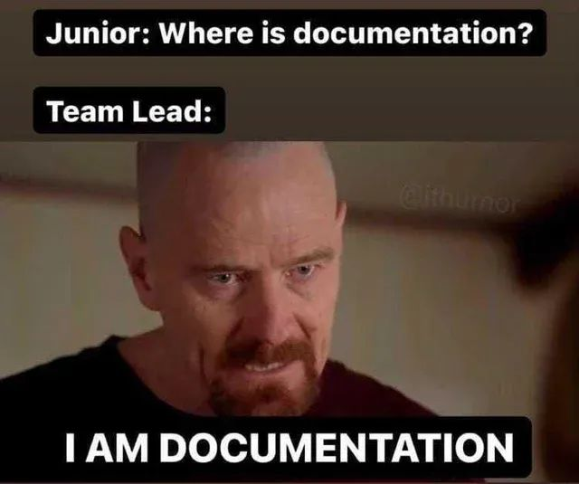

### Żeby nie było za różowo...

---

## Typowe problemy

- wiedza plemienna
- konieczność szybkiego zdobycia wiedzy branżowej/biegłej znajomości dokumentowanej usługi lub produktu
- umiejętności miękkie/komunikacyjne (relacje z SME)
